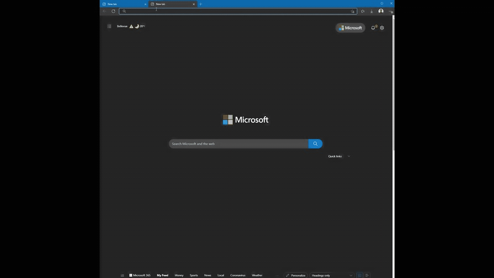

# Semantic Search with Intelligent Recommedations

This repository contains a react webapp that integrates [Azure Semantic Search](https://docs.microsoft.com/en-us/azure/search/semantic-search-overview) with [Azure Intelligent Recommedations Service.](https://docs.microsoft.com/en-us/industry/retail/intelligent-recommendations/overview)

This is project has three main components. 

* React based web app that can be deployed to Azure Storage Webapp
* Backend API which provides a facade for Azure Search and Intelligent Recommendations API services
* Azure Search setup utility to configure the Azure Search Index. 

## Getting started

#### Prerequisites

The project requires the below Azure Services to be provisioned.
* Azure Cognitive Search with Semantic Feature enabled.
* Azure Intelligent Recommendations Service and a model trained and serving endpoint provisioned. 
* Azure Blob Storage.

## Step 1. Create search Index

From the search-setup folder, you can the azure-search-with-custom-index.ipynb to configure the search index. 

## Step 2. Provision the backend API as Azure Function App

The backend-api folder has an Azure Function that provides a facade to Azure Cognitive Search and Azure Intelligent Recommendations Service. This can be provisioned to Azure Functions using az cli or VS Code. 

## Step 3. Deploy the react-webapp to Azure Storage webapp 

Run the below commands on the reach-webapp folder.

        npm install
        npm run build

This creates a build folder with the react webapp created as single page application. The contents of the build folder needs to uploaded to website enabled Azure Storage container to the default file pointing to index.html.

## Demo

In the Demo below, it shows the following capabilities

* Lemmatization - Even though an incorrect search term "authencity leather" is provided, the results are retrieved for "authentic leather".
* Semantic Search Ranking - The semantic configuration is provided on the Title and Description fields and the results are ranked using semantic ranking.

* Key phrase extraction - Key phrases can be extracted from text fields in the index and faceted navigation can be provided to drill down on the search items.

* Navigate to similar items - Uses a trained model in Azure Intelligent Recommendations(Azure IR) to retrieve the similar items for the selected item. 

* Popular Items - When now search terms are provided on the landing page, the UI display the Popular items from the Azure IR service

